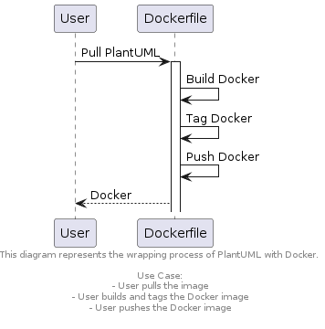
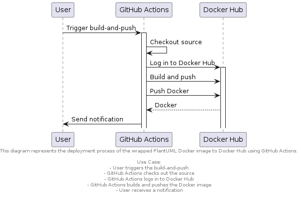
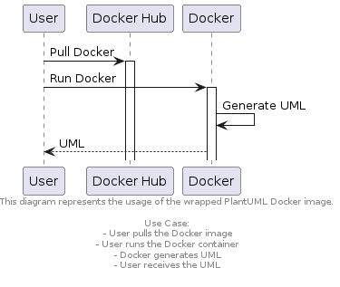

# PlantUML Docker

This Docker image enables generating UML diagrams using PlantUML.

## How to Update and Deploy

To update and deploy a new version of the PlantUML Docker image when there is a new release in the PlantUML repository, follow these steps:

1. Ensure Docker is installed on your machine.

2. Clone the PlantUML Docker repository:
   ```bash
   git clone https://github.com/smeyerhuky/plantuml_docker.git
   ```

3. Navigate to the cloned repository:
   ```bash
   cd plantuml_docker
   ```

4. Update the Dockerfile with the latest PlantUML version. Find the latest release on the [PlantUML GitHub Releases page](https://github.com/plantuml/plantuml/releases).

5. Build the Docker image:
   ```bash
   docker build -t smeyerhuky/plantuml .
   ```

6. Tag the Docker image with the PlantUML version:
   ```bash
   docker tag smeyerhuky/plantuml smeyerhuky/plantuml:<plantuml_version>
   ```

   Replace `<plantuml_version>` with the specific PlantUML version you are using.

7. Push the Docker image to Docker Hub:
   ```bash
   docker push smeyerhuky/plantuml:<plantuml_version>
   ```

   Replace `<plantuml_version>` with the version you tagged in the previous step.

8. The Docker image is now updated and available on Docker Hub.

Note: Remember to update the Dockerfile and tag the image with the appropriate version for each release.

## Diagrams

Below are the diagrams representing the different processes involved:

### Wrapping Process



### Deployment Process



### Usage Process



